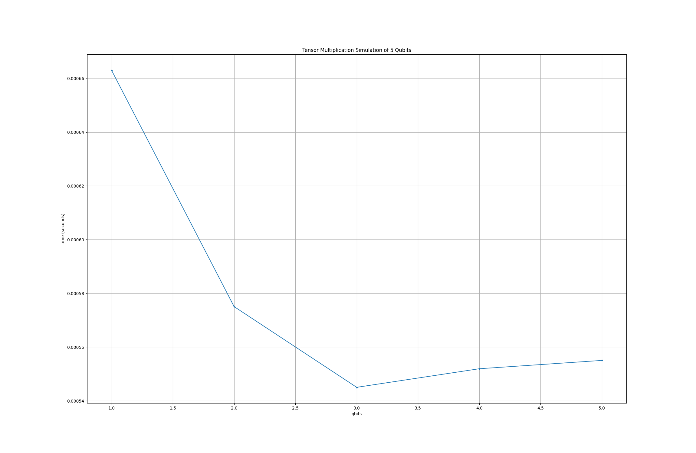
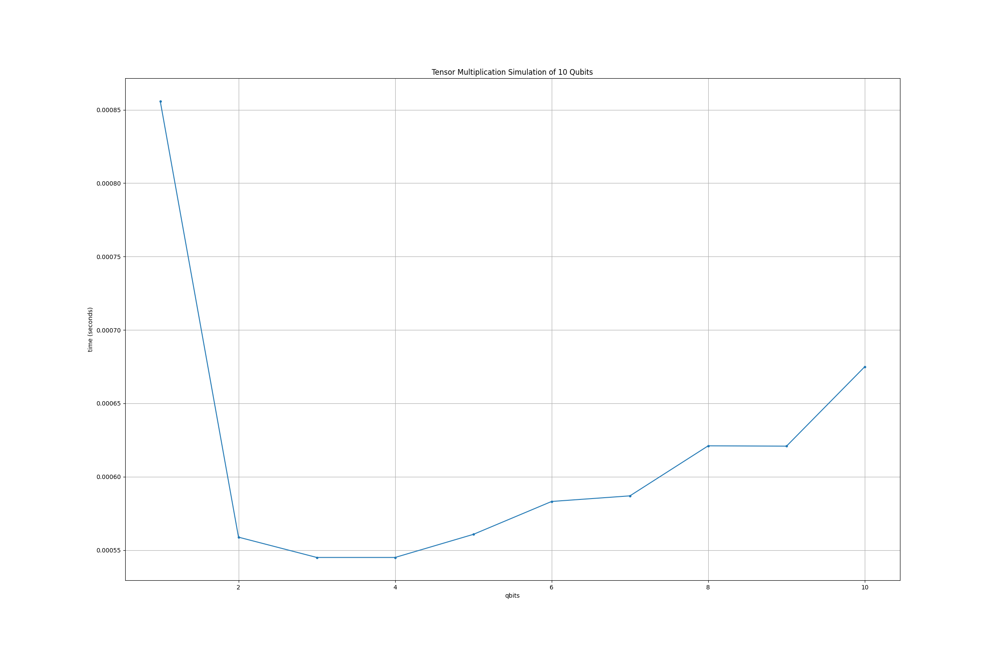
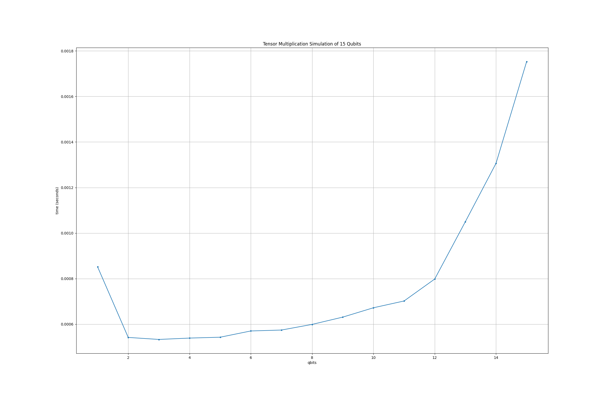
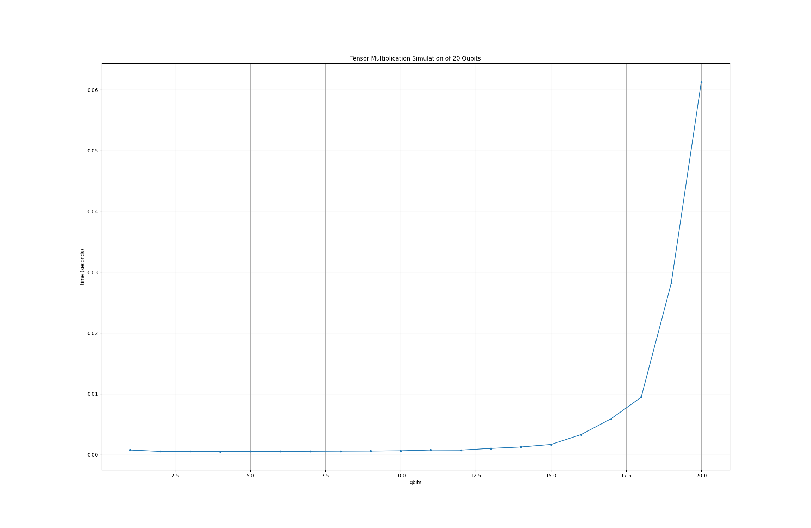
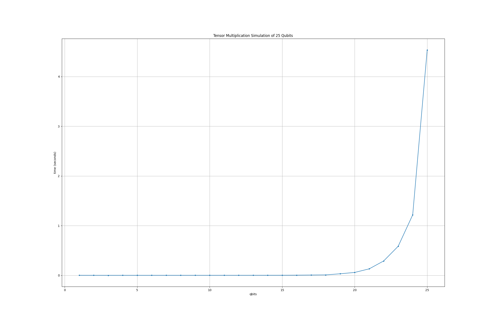
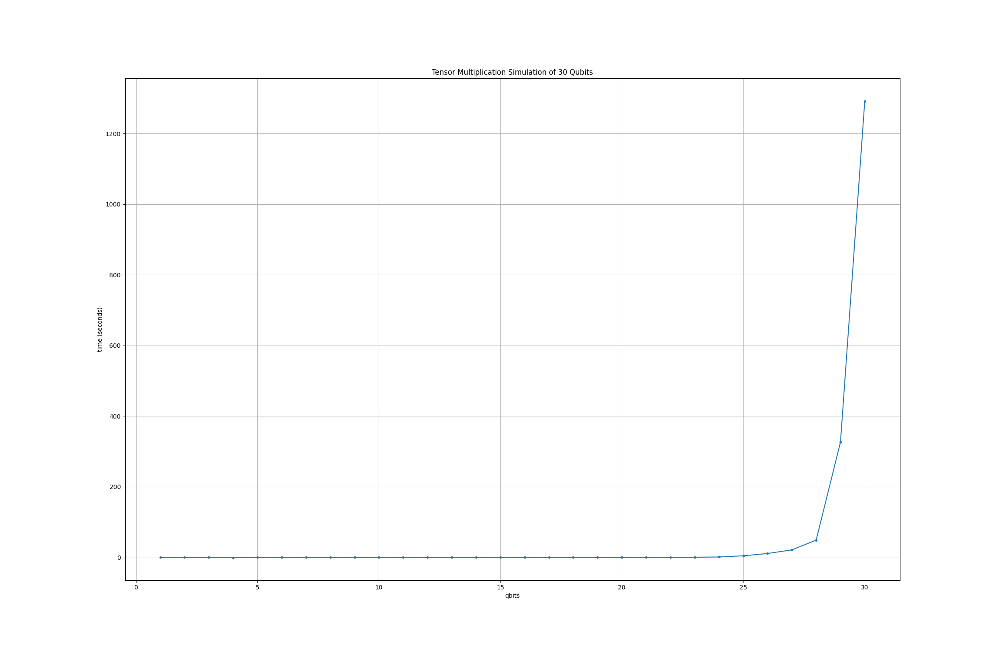

# Subtask 2: Advanced simulation using tensor multiplication

## Simulation implementation

[advanced_simulation.py](advanced_simulation.py) is the file with the implementation to simulate the execution of the quantum circuit.

### Used libraries

- **Numpy**: for handling vectors and operations on them.
- **time**: to calculate the simulation run time.

### Functions and objects

```python
def operate_single_gate(gate, state, n_qubits):
    state_reshaped = state.reshape(tuple([2] * n_qubits))

    state_reshaped = np.tensordot(
        np.eye(2),
        np.tensordot(gate, state_reshaped, axes=1),
        axes=1
    )

    state = state_reshaped.reshape(2 ** n_qubits)
    return state
```

`operate_single_gate` is a function to use the tensor multiplication for apply a quantum gate to a quantum state, is implemented using the `np.tensordot`
function since is being used `np.reshape` to convert the state vector of 2^n as an n-dimensional tensor.

```python
def run_circuit(state, circuit):
    for gate in circuit:
        match gate:
            case 'I':  # Identity Gate
                state = operate_single_gate(gate_i, state)

            case 'X':  # Pauli's X Gate
                state = operate_single_gate(gate_x, state)
            case 'Y':  # Pauli's Y Gate
                state = operate_single_gate(gate_y, state)
            case 'Z':  # Pauli's Z Gate
                state = operate_single_gate(gate_z, state)

            case 'H':  # Hadamard Gate
                state = operate_single_gate(gate_h, state)

            case 'CNOT':  # CNOT Gate
                state = operate_single_gate(gate_c_not, state)

            case _:
                print("Unknown gate")

    return state
```

`run_circuit (General)` is a function to apply sequentially all the gates in the circuit list to a quantum state. 
The logic is to check every gate on the list, verify which gate is and apply it 
(if is a gate defined as admitted) using the function described previously `operate_single_gate`

```python
class QuantumCircuit
```

`QuantumCircuit` is the definition of a Quantum Circuit with a state vector, a circuit to apply and the number of qubits represented at the state vector.

```python
def __init__(self, n_qubits, circuit):
    self.qubits = n_qubits
    n_tuples = (2 ** n_qubits) // 2
    self.state_vector = np.array(ket_0 * n_tuples).reshape(tuple([2] * n_qubits))
    self.circuits = np.array(circuit)

    assert self.state_vector.size != 0 and self.circuits.size != 0
```

This is the `QuantumCircuit` constructor, will receive the number of `n_qubits` to handle and the `circuit` to apply.
The state vector is initialized with quantum state |0⟩, this applies to all the qubits.

```python
def run_circuit(self):
    start = time.time()
    run_circuit(self.state_vector, self.circuits, self.qubits)
    end = time.time()
    return end - start
```

`run_circuit (QuantumCircuit)` class function, takes the simulation run time and returns the final time. 
To execute the circuit, uses the general function `run_circuit (General)` that was already described.

## Simulation execution and n tests

How to test the simulator is in the [advanced_test.py](advanced_test.py) file, 
below is an explanation of the parts that this implementation contains.

### Used libraries

- **matplotlib.pyplot**: to graph the execution time.

### Code explanation

```python
circuit = ['H', 'X', 'I', 'H', 'Z', 'I', 'H', 'X', 'H', 'Z']
qubits = 5
```

`circuit` defines the list of quantum gates that make up the circuit to be applied to the state vector. 
And `qubits` the amount of qubits that will handle the state vector.

```python
final_time = []
for i in range(1, qubits + 1):
    quantum_circuit = QuantumCircuit(
        n_qubits=i,
        circuit=circuit,
    )
    final_time.append(quantum_circuit.run_circuit())
```

This code is the heart of the simulation, at the `final_time` array will be save the execution time for each simulation (n qubits). 
Then is a for loop that will achieve n simulations, up the number of qubits defined. Inside the for loop is being created a
`QuantumCircuit` object to represente the circuit with n qubits. Finally is being executed the circuit using the 
`run_circuit (QuantumCircuit)` function and saving the executed time at the `final_time` array.

```python
plt.figure(figsize=(23, 15))
plt.plot(range(1, qubits + 1), final_time, 'o-', markersize=3)
plt.title(f"Tensor Multiplication Simulation of {qubits} Qubits")
plt.xlabel('qbits')
plt.ylabel('time (seconds)')
plt.grid(True)
plt.show()
```

Basically, this code is responsible for drawing the time vs qubits graph that can be used to analyze the performance of the simulator.

## Simulation results

This code and simulations were performed on a Macbook pro i9 with 16 GB of RAM. 
The break point for this type of simulation came at 30 qubits where an exponential jump occurred from 3 seconds to approximately 13 seconds in execution time.

We must also take into consideration that a 10-gate circuit was used, 
this performance may vary based on the specifications of the device that performs the simulation and the type of circuit to be executed. 
Another aspect to consider is that the tests were always performed from 1 to n, and running the simulation multiple times can affect the behavior.

Below are the graphs of the tests that were performed, increasing the number of bits to be executed.

### Simulation up to 5 qubits



In this graph you can see that none of the five simulations takes more than 1 millisecond. 
Another curious aspect is that the graph starts with a peak in the first attempt and then goes down, 
due to the total number of simulations (5 in total) this is perfectly normal, especially since it was the first simulation, 
the systems have something called the initial loading time of a function, and that is why we see this small peak in the first functions that then stabilizes.

### Simulation up to 10 qubits



### Simulation up to 15 qubits



### Simulation up to 20 qubits



### Simulation up to 25 qubits



### Simulation up to 30 qubits




