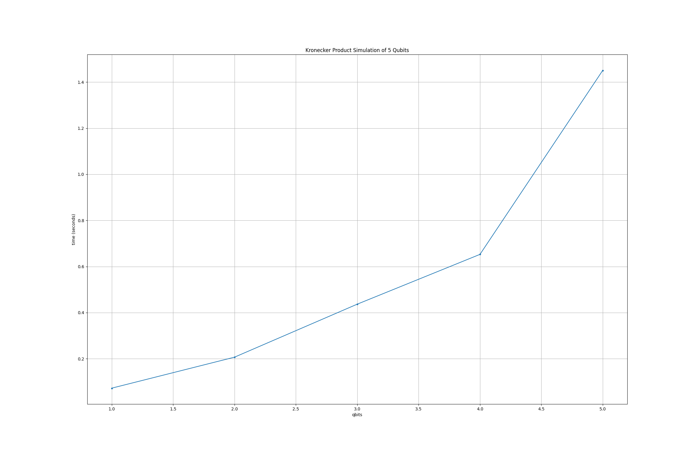
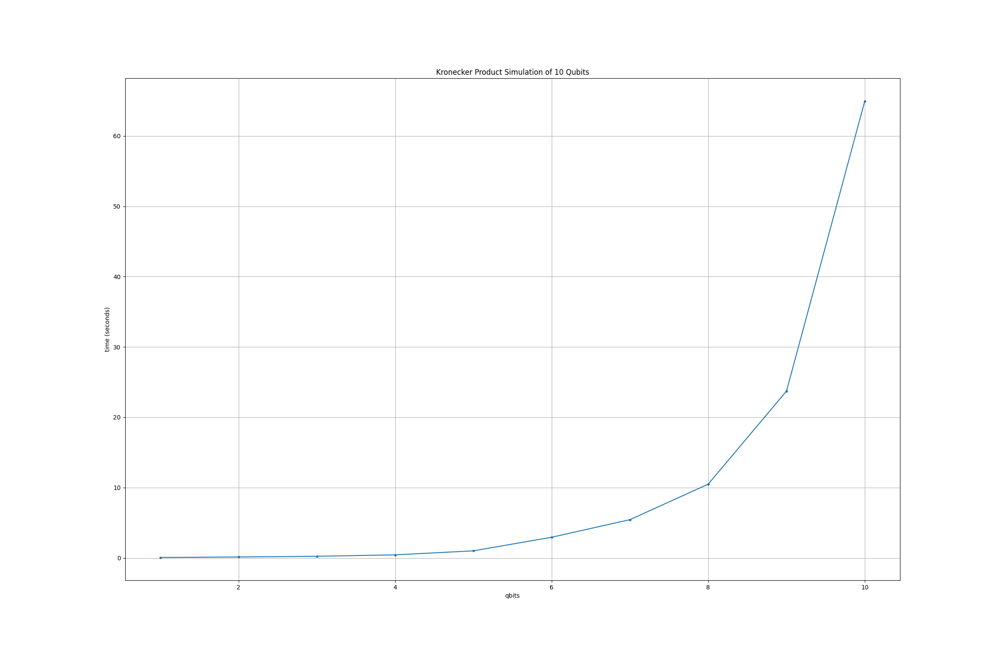

# Subtask 1: Naive simulation using matrix multiplication

## Simulation implementation

[naive_simulation.py](naive_simulation.py) is the file with the implementation to simulate the execution of the quantum circuit.

### Used libraries

- **Numpy**: for handling vectors and operations on them.
- **time**: to calculate the simulation run time.

### Functions and objects

```python
def operate_gate(gate, state):
    return np.kron(gate, state)
```

`operate_gate` is a function to use the Kronecker Product for apply a quantum gate to a quantum state, 
is implemented using the `np.kron` function.

```python
def run_circuit(state, circuit):
    for gate in circuit:
        match gate:
            case 'I':  # Identity Gate
                state = operate_gate(gate_i, state)

            case 'X':  # Pauli's X Gate
                state = operate_gate(gate_x, state)
            case 'Y':  # Pauli's Y Gate
                state = operate_gate(gate_y, state)
            case 'Z':  # Pauli's Z Gate
                state = operate_gate(gate_z, state)

            case 'H':  # Hadamard Gate
                state = operate_gate(gate_h, state)

            case 'CNOT':  # CNOT Gate
                state = operate_gate(gate_c_not, state)

            case _:
                print("Unknown gate")

    return state
```

`run_circuit (General)` is a function to apply sequentially all the gates in the circuit list to a quantum state. 
The logic is to check every gate on the list, verify which gate is and apply it 
(if is a gate defined as admitted) using the function described previously `operate_gate`

```python
class QuantumCircuit
```

`QuantumCircuit` is the definition of a Quantum Circuit with a state vector, a circuit to apply and the number of qubits represented at the state vector.

```python
def __init__(self, qubits, circuit):
    self.qubits = qubits
    n_tuples = (2 ** qubits) // 2
    self.state_vector = np.array(ket_0 * n_tuples)
    self.circuits = np.array(circuit)

    assert self.state_vector.size != 0 and self.circuits.size != 0
```

This is the `QuantumCircuit` constructor, will receive the number of `qubits` to handle and the `circuit` to apply.
The state vector is initialized with quantum state |0⟩, this applies to all the qubits.

```python
def run_circuit(self):
    start = time.time()
    run_circuit(self.state_vector, self.circuits)
    end = time.time()
    return end - start
```

`run_circuit (QuantumCircuit)` class function, takes the simulation run time and returns the final time. 
To execute the circuit, uses the general function `run_circuit (General)` that was already described.

## Simulation execution and n tests

How to test the simulator is in the [naive_test.py](naive_test.py) file, below is an explanation of the parts that this
implementation contains.

### Used libraries

- **matplotlib.pyplot**: to graph the execution time

### Code explanation

```python
circuit = ['H', 'X', 'I', 'H', 'Z', 'CNOT', 'H', 'X', 'H', 'Z']
qubits = 10
```

`circuit` defines the list of quantum gates that make up the circuit to be applied to the state vector. 
And `qubits` the amount of qubits that will handle the state vector.

```python
final_time = []
for i in range(1, qubits + 1):
    quantum_circuit = QuantumCircuit(
        n_qubits=i,
        circuit=circuit,
    )
    final_time.append(quantum_circuit.run_circuit())
```

This code is the heart of the simulation, at the `final_time` array will be saved the execution time for each simulation (n qubits). 
Then is a for loop that will achieve n simulations, up the number of qubits defined. Inside the for loop is being created a
`QuantumCircuit` object to represente the circuit with n qubits. Finally is being executed the circuit using the 
`run_circuit (QuantumCircuit)` function and saving the executed time at the `final_time` array.

```python
plt.figure(figsize=(23, 15))
plt.plot(range(1, qubits + 1), final_time, 'o-', markersize=3)
plt.title(f"Kronecker Product Simulation of {qubits} Qubits")
plt.xlabel('qbits')
plt.ylabel('time (seconds)')
plt.grid(True)
plt.show()
```

Basically, this code is responsible for drawing the time vs qubits graph that can be used to analyze the performance of the simulator.

## Simulation results

### Simulation up to 5 qubits



### Simulation up to 10 qubits



### Simulation up to 11 qubits


